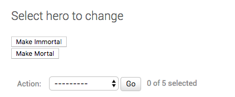
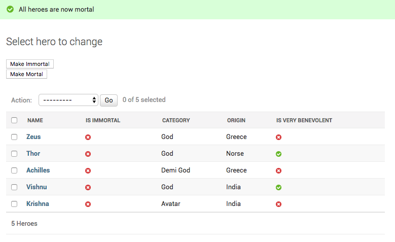

How to add Custom Action Buttons (not actions) to Django Admin list page?
++++++++++++++++++++++++++++++++++++++++++++++++++++++++++++++++++++++++++

UMSRA has decided that given sufficient kryptonite, all Heroes are mortal.
However, they want to be able to change their mind and say all heroes are immortal.

You have been absked to add two buttons - One which makes all heroes mortal, and one which makes all immortal. Since it affects all heores irrespective of the selection, this needs to be a separate button, not an action dropdown.

First, we will change the template on the :code:`HeroAdmin` so we can add two buttons.:

    @admin.register(Hero)
    class HeroAdmin(admin.ModelAdmin, ExportCsvMixin):
        change_list_template = "entities/heroes_changelist.html"

Then we will override the :code:`get_urls`, and add the :code:`set_immortal` and :code:`set_mortal` methods on the model admin. They will serve as the two view methods.

    def get_urls(self):
        urls = super().get_urls()
        my_urls = [
            path('immortal/', self.set_immortal),
            path('mortal/', self.set_mortal),
        ]
        return my_urls + urls

    def set_immortal(self, request):
        self.model.objects.all().update(is_immortal=True)
        self.message_user(request, "All heroes are now immortal")
        return HttpResponseRedirect("../")

    def set_mortal(self, request):
        self.model.objects.all().update(is_immortal=False)
        self.message_user(request, "All heroes are now mortal")
        return HttpResponseRedirect("../")

Finally, we create the :code:`entities/heroes_changelist.html` template by extending the :code:`admin/change_list.html`.

    

    
        

            <form action="immortal/" method="POST">
                
                    <button type="submit">Make Immortal</button>
            </form>
            <form action="mortal/" method="POST">
                
                    <button type="submit">Make Mortal</button>
            </form>
        

         
        {{ block.super }}
    

And after using the `make_mortal` action, the Heroes are all mortal and you see this message.

