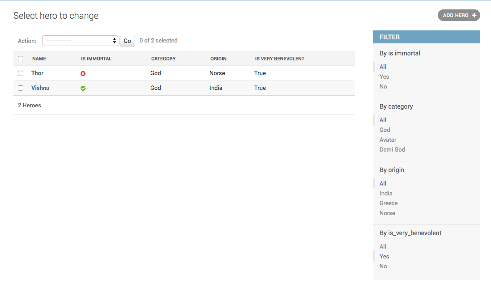
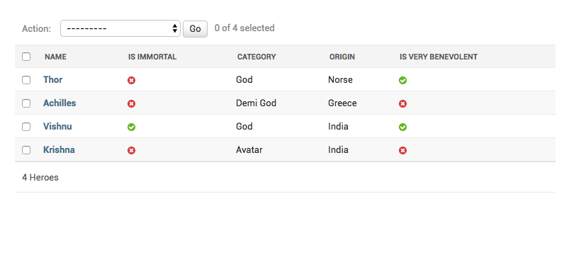

How to show “on” or “off” icons for calculated boolean fields?
+++++++++++++++++++++++++++++++++++++++++++++++++++++++++++++++

In the previous chapter, :doc:`filtering_calculated_fields` you added a boolean field.::

    def is_very_benevolent(self, obj):
        return obj.benevolence_factor > 75

Which looks like this

The :code:`is_very_benevolent` field show the string `True` and `False`, unlike the builin BooleanFields which show an on and off indicator.
To fix this, you add a :code:`boolean` attribute on your method. You final modeladmin looks like this::

    @admin.register(Hero)
    class HeroAdmin(admin.ModelAdmin):
        list_display = ("name", "is_immortal", "category", "origin", "is_very_benevolent")
        list_filter = ("is_immortal", "category", "origin", IsVeryBenevolentFilter)

        def is_very_benevolent(self, obj):
            return obj.benevolence_factor > 75

        is_very_benevolent.boolean = True

And your admin looks like this

