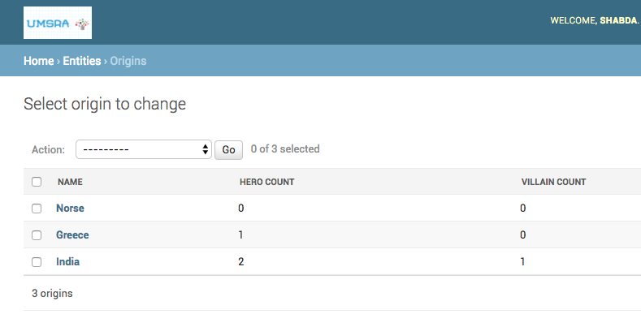

How to show calculated fields on listview page?
===========================================================

You have an admin for the :code:`Origin` model like this::

    @admin.register(Origin)
    class OriginAdmin(admin.ModelAdmin):
        list_display = ("name",)

Apart from the name, we also want to show the number of heroes and number of villains for each origin, which is not a DB field on :code:`Origin`.
You can do this in two ways.

Adding a method to the model
++++++++++++++++++++++++++++++++++++++++++

You can add two methods to your :code:`Origin` model like this::

    def hero_count(self,):
        return self.hero_set.count()

    def villain_count(self):
        return self.villain_set.count()

And change :code:`list_display` to :code:`list_display = ("name", "hero_count", "villain_count")`.

Adding a method to the ModelAdmin
++++++++++++++++++++++++++++++++++++++++++

If you don't want to add method to the model, you can do instead add the method to the ModelAdmin. ::

    def hero_count(self, obj):
        return obj.hero_set.count()

    def villain_count(self, obj):
        return obj.villain_set.count()

The :code:`list_display`, as earlier, changes to :code:`list_display = ("name", "hero_count", "villain_count")`.

Performance considerations for calculated_fields
++++++++++++++++++++++++++++++++++++++++++++++++++++++++++++++++++++++++++++++++++++

With either of the above approaches, you would be running two exta queries per object (One per calculated field). You can find how to optimize this in
:doc:`optimize_queries`.

With any of these changes your admin looks like this:

