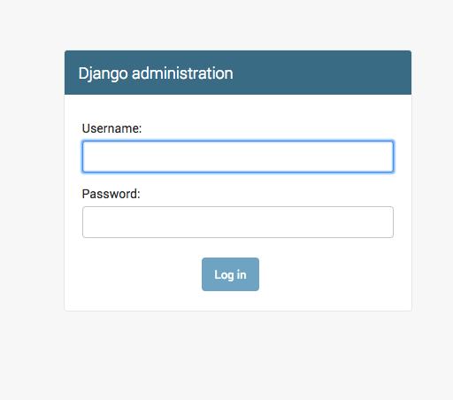
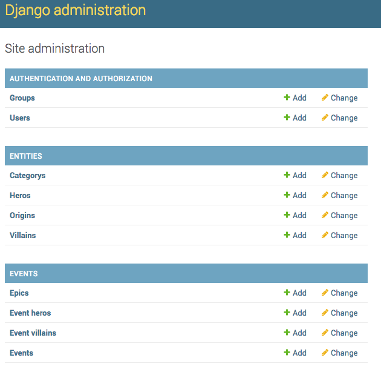
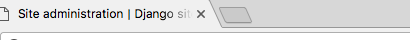

How to change 'Django administration' text?
================================================

By default Django admin shows 'Django administration'. You have been asked to replace this with 'UMSRA Administration'

The text is at these pages:

- Login Page
- The listview page
- The HTML title tag

Login, Listview and Changeview Page
++++++++++++++++++++++++++++++++++++++++++++

By default it looks like this and is set to :code:`“Django administration”`

:code:`site_header` can be set to change this.

Listview Page
++++++++++++++++++++++

By default it looks like this and is set to :code:`“Site administration”`

:code:`index_title` can be set to change this.

HTML title tag
++++++++++++++++++++++

By default it looks like this and is set to :code:`“Django site admin”`

:code:`site_title` can be set to change this.

We can make the three changes in urls.py::

    admin.site.site_header = "UMSRA Admin"
    admin.site.site_title = "UMSRA Admin Portal"
    admin.site.index_title = "Welcome to UMSRA Researcher Portal"

