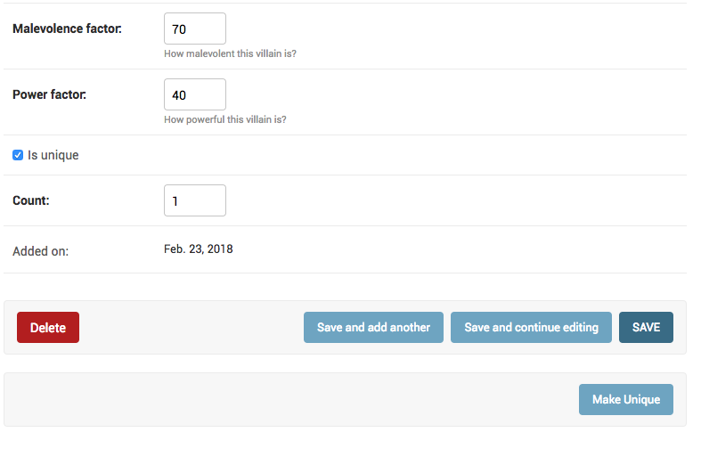

How to add a custom button to Django change view page?
++++++++++++++++++++++++++++++++++++++++++++++++++++++++++++++++++++++++++++++++++++

:code:`Villain` has a field called :code:`is_unique`::

    class Villain(Entity):
        ...
        is_unique = models.BooleanField(default=True)

You want to add a button on Villain change form page called "Make Unique", which make this Villain unique.
Any other villain with the same name should be deleted.

You start by extending the :code:`change_form` to add a new button.::

    

    
        {{ block.super }}
        

                <input type="submit" value="Make Unique" name="_make-unique">
        

    

Then you can override :code:`response_change` and connect your template to the :code:`VillainAdmin`.::

    @admin.register(Villain)
    class VillainAdmin(admin.ModelAdmin, ExportCsvMixin):
        ...
        change_form_template = "entities/villain_changeform.html"

        def response_change(self, request, obj):
            if "_make-unique" in request.POST:
                matching_names_except_this = self.get_queryset(request).filter(name=obj.name).exclude(pk=obj.id)
                matching_names_except_this.delete()
                obj.is_unique = True
                obj.save()
                self.message_user(request, "This villain is now unique")
                return HttpResponseRedirect(".")
            super().response_change(request, obj)

This is how your admin looks now.

