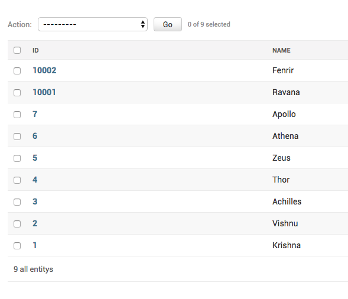

How to add a database view to Django admin?
++++++++++++++++++++++++++++++++++++++++++++++++++++++++++++++++++++++++++++++++++++

You have a database view, created as this::

    create view entities_entity as
        select id, name from entities_hero
        union
        select 10000+id as id, name from entities_villain

It has all the names from :code:`Hero` and :code:`Villain`. The id for Villain ae set :code:`10000+id as id`
because we don't indent to cross 10000 Heroes::

    sqlite> select * from entities_entity;
    1|Krishna
    2|Vishnu
    3|Achilles
    4|Thor
    5|Zeus
    6|Athena
    7|Apollo
    10001|Ravana
    10002|Fenrir

Then you add a :code:`managed=False` model::

    class AllEntity(models.Model):
        name = models.CharField(max_length=100)

        class Meta:
            managed = False
            db_table = "entities_entity"

And add it to admin.::

    @admin.register(AllEntity)
    class AllEntiryAdmin(admin.ModelAdmin):
        list_display = ("id", "name")

And your admin looks like this

