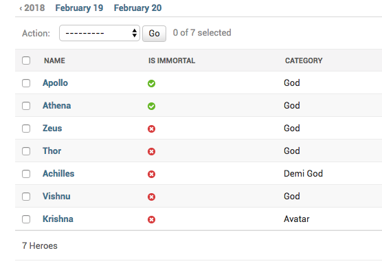

How to add date based filtering in Django admin?
+++++++++++++++++++++++++++++++++++++++++++++++++++++++++++++++

You can add a date based filtering on any date field by setting the :code:`date_hierarchy`.::

    @admin.register(Hero)
    class HeroAdmin(admin.ModelAdmin, ExportCsvMixin):
        ...
        date_hierarchy = 'added_on'

It looks like this:

This can be very costly with a large number of objects. As an alternative, you can subclass :code:`SimpleListFilter`, and allow filtering only on years or the months.
