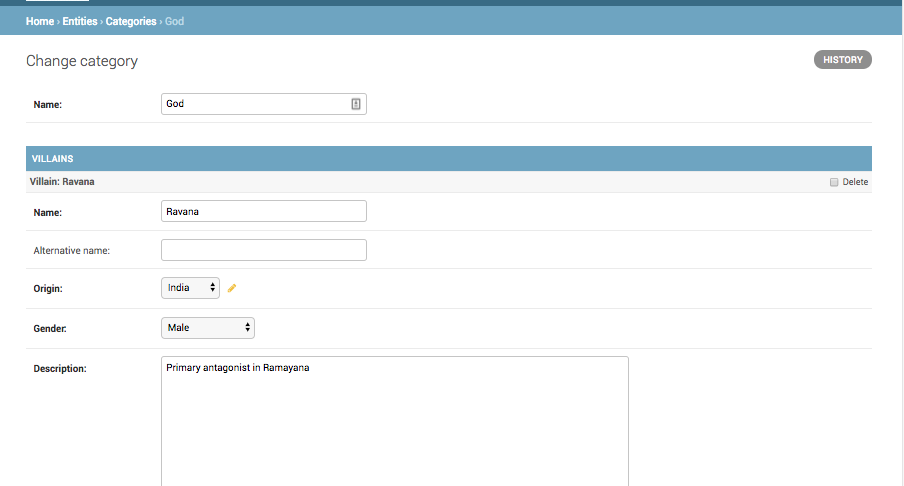

How to edit mutiple models from one Django admin?
=====================================================

To be able to edit multiple objects from one Django admin, you need to use inlines.

You have the :code:`Category` model, and you need to add and edit :code:`Villain` models inside the admin for Category. You can do::

    class VillainInline(admin.StackedInline):
        model = Villain

    @admin.register(Category)
    class CategoryAdmin(admin.ModelAdmin):
        ..

        inlines = [VillainInline]

You can see the form to add and edit :code:`Villain` inside the :code:`Category` admin. If the Inline model has alot of fields,
use :code:`StackedInline` else use :code:`TabularInline`.

