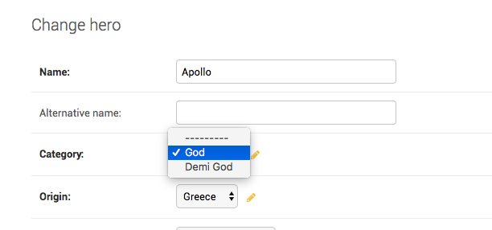

How to filter FK dropdown values in django admin?
+++++++++++++++++++++++++++++++++++++++++++++++++++++++++++++++++++++

Your :code:`Hero` model has a FK to :code:`Category`.
So all category objects will show in the admin dropdown for category. If instead, you wanted to see only a subset,
Django allows you to customize that by overriding :code:`formfield_for_foreignkey`::

    @admin.register(Hero)
    class HeroAdmin(admin.ModelAdmin, ExportCsvMixin):
        ...
        def formfield_for_foreignkey(self, db_field, request, **kwargs):
            if db_field.name == "category":
                kwargs["queryset"] = Category.objects.filter(name__in=['God', 'Demi God'])
            return super().formfield_for_foreignkey(db_field, request, **kwargs)

