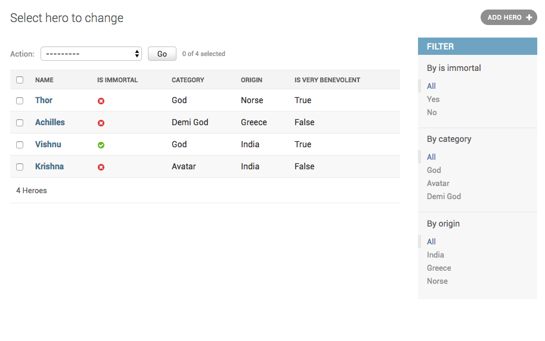

How to enable filtering on calculated fields?
===========================================================

You have a :code:`Hero` admin which looks like this::

    @admin.register(Hero)
    class HeroAdmin(admin.ModelAdmin):
        list_display = ("name", "is_immortal", "category", "origin", "is_very_benevolent")
        list_filter = ("is_immortal", "category", "origin",)

        def is_very_benevolent(self, obj):
            return obj.benevolence_factor > 75

It has one calculated field :code:`is_very_benevolent`, and your admin looks like this

You have added filtering on the fields which come from the models, but you also want to add filtering on the calculated field. To do this, you will need to subclass
:code:`SimpleListFilter` like this::

    class IsVeryBenevolentFilter(admin.SimpleListFilter):
        title = 'is_very_benevolent'
        parameter_name = 'is_very_benevolent'

        def lookups(self, request, model_admin):
            return (
                ('Yes', 'Yes'),
                ('No', 'No'),
            )

        def queryset(self, request, queryset):
            value = self.value()
            if value == 'Yes':
                return queryset.filter(benevolence_factor__gt=75)
            elif value == 'No':
                return queryset.exclude(benevolence_factor__gt=75)
            return queryset

And then change your :code:`list_filter` to :code:`list_filter = ("is_immortal", "category", "origin", IsVeryBenevolentFilter)`.

With this you can filter on the calculated field, and your admin looks like this:

.. image:: filter_calculated_fixed.png
