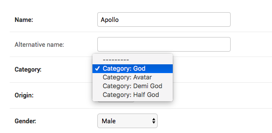

How to change ForeignKey display text in dropdowns?
++++++++++++++++++++++++++++++++++++++++++++++++++++++++++++++++++++++++++++++++++++

:code:`Hero` has a FK to :code:`Catgeory`. In the dropdown, rather than just the name, you want to show the text "Category: <name>".

You can change the :code:`__str__` method on :code:`Category`, but you only want this change in the admin.
You can do this by creating a subclassing :code:`forms.ModelChoiceField` with a custom :code:`label_from_instance`.::

    class CategoryChoiceField(forms.ModelChoiceField):
         def label_from_instance(self, obj):
             return "Category: {}".format(obj.name)

You can then override :code:`formfield_for_foreignkey` to use this field type for category.::

    def formfield_for_foreignkey(self, db_field, request, **kwargs):
        if db_field.name == 'category':
            return CategoryChoiceField(queryset=Category.objects.all())
        return super().formfield_for_foreignkey(db_field, request, **kwargs)

Your admin look like this.

