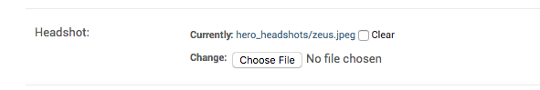
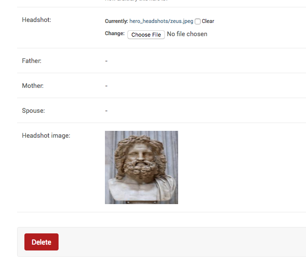

How to show image from Imagefield in Django admin.
++++++++++++++++++++++++++++++++++++++++++++++++++++++++++++++++++++++++++++++++++++

In your :code:`Hero` model, you have an image field.::

    headshot = models.ImageField(null=True, blank=True, upload_to="hero_headshots/")

By default it shows up like this:

You have been asked to change it to that the actual image also shows up on the change page. You can do it likethis::

        @admin.register(Hero)
        class HeroAdmin(admin.ModelAdmin, ExportCsvMixin):

            readonly_fields = [..., "headshot_image"]

            def headshot_image(self, obj):
                return mark_safe(''.format(
                    url = obj.headshot.url,
                    width=obj.headshot.width,
                    height=obj.headshot.height,
                    )
            )

With this change, your imagefield looks like this:

