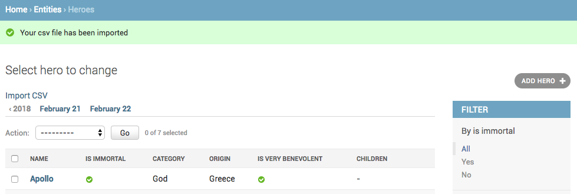
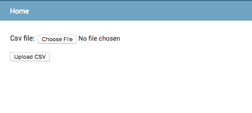

How to import CSV using Django admin?
++++++++++++++++++++++++++++++++++++++

You have been asked to allow csv imports on the :code:`Hero` admin. You will do this by adding a link to the :code:`Hero` changelist page, which will take to a page with an upload form. You will write a handler for the `POST` action to create the objects from the csv.::

    class CsvImportForm(forms.Form):
        csv_file = forms.FileField()

    @admin.register(Hero)
    class HeroAdmin(admin.ModelAdmin, ExportCsvMixin):
        ...
        change_list_template = "entities/heroes_changelist.html"

        def get_urls(self):
            urls = super().get_urls()
            my_urls = [
                ...
                path('import-csv/', self.import_csv),
            ]
            return my_urls + urls

        def import_csv(self, request):
            if request.method == "POST":
                csv_file = request.FILES["csv_file"]
                reader = csv.reader(csv_file)
                # Create Hero objects from passed in data
                # ...
                self.message_user(request, "Your csv file has been imported")
                return redirect("..")
            form = CsvImportForm()
            payload = {"form": form}
            return render(
                request, "admin/csv_form.html", payload
            )

Then you create the :code:`entities/heroes_changelist.html` templatee, by overriding the :code:`admin/change_list.html` template like this.::

    

    
        <a href="import-csv/">Import CSV</a>
         
        {{ block.super }}
    

Finally you create the :code:`csv_form.html` like this.::

    

    
        

            <form action="." method="POST" enctype="multipart/form-data">
                {{ form.as_p }}
                

                    <button type="submit">Upload CSV</button>
            </form>
        

         

    

With these changes, you get a link on the :code:`Hero` changelist page.

And the import form apge looks like this.

