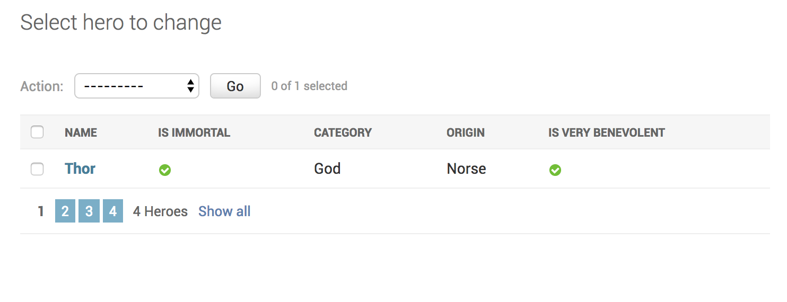

How to show larger number of rows on listview page?
+++++++++++++++++++++++++++++++++++++++++++++++++++++++++++++++

You have been asked to increase the number of heroes one can see on a single page to 250. (The default is 100). You can do this by::

    @admin.register(Hero)
    class HeroAdmin(admin.ModelAdmin, ExportCsvMixin):
        ...
        list_per_page = 250

You can also set it to a smaller value. If we set it to 1 as :code:`list_per_page = 1` the admin looks like this.

