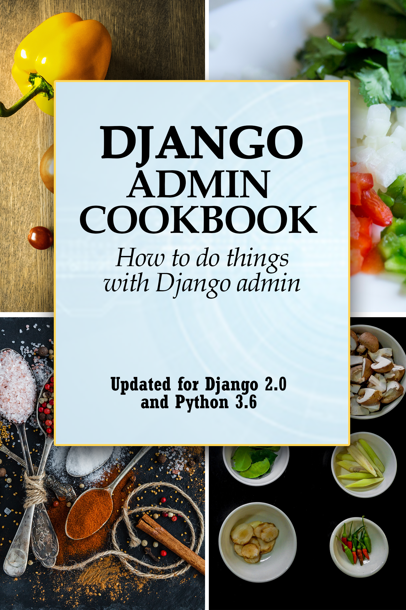

Django Admin Cookbook
===========================================================

Django Admin Cookbook - How to do things with Django admin.
+++++++++++++++++++++++++++++++++++++++++++++++++++++++++++++++

This is a book about doing things with Django admin. It takes the form of about forty questions and common tasks with Django admin we answer.

The chapters are based on a common set of models, which you can read in detail here (:doc:`models`). In short, we have two apps,
:code:`events` and :code:`entities`. The models are

* Events: :code:`Epic`, :code:`Event`, :code:`EventHero`, :code:`EventVillian`
* Entities: :code:`Category`, :code:`Origin`, :code:`Hero`, :code:`Villain`

.. toctree::
   :maxdepth: 1

   introduction

Text and Design
+++++++++++++++++++++

.. toctree::
   :maxdepth: 1
   :numbered:

   change_text
   plural_text
   two_admin
   remove_default
   logo
   override_default_templates

Calculated fields
+++++++++++++++++++++

.. toctree::
   :maxdepth: 1
   :numbered:

   calculated_fields
   optimize_queries
   sorting_calculated_fields
   filtering_calculated_fields
   boolean_fields

Bulk and custom actions
++++++++++++++++++++++++++++++++++++++++++

.. toctree::
   :maxdepth: 1
   :numbered:

   add_actions
   export
   remove_delete_selected
   action_buttons
   import

Permissions
+++++++++++++++++++++

.. toctree::
   :maxdepth: 1
   :numbered:

   specific_users
   restrict_parts
   only_one
   remove_add_delete

Multiple models and inlines
++++++++++++++++++++++++++++++++++++++++++

.. toctree::
   :maxdepth: 1
   :numbered:

   edit_multiple_models
   one_to_one_inline
   nested_inlines
   single_admin_multiple_models

Listview Page
++++++++++++++++++++++++++++++++++++++++++

.. toctree::
   :maxdepth: 1
   :numbered:

   increase_row_count
   disable_pagination
   date_based_filtering
   many_to_many

Changeview Page
++++++++++++++++++++++++++++++++++++++++++

.. toctree::
   :maxdepth: 1
   :numbered:

   imagefield
   current_user
   changeview_readonly
   uneditable_field
   uneditable_existing
   filter_fk_dropdown
   many_fks
   fk_display
   custom_button

Misc
++++++++++++++++++++++++++++++++++++++++++

.. toctree::
   :maxdepth: 1
   :numbered:

   object_url
   add_model_twice
   override_save
   database_view
   set_ordering

Indices and tables
+++++++++++++++++++++
.. toctree::
   :maxdepth: 1

   models

* :ref:`genindex`
