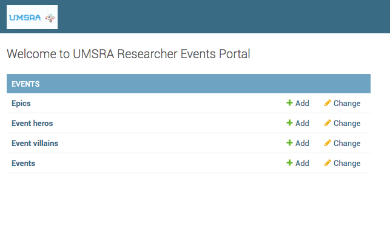

How to add a logo to Django admin?
===========================================================

Your higher ups at UMSRA love the admin you have created till now, but marketing wants to put the UMSRA logo on all admin pages.

You need to override the default templates provided by Django. In your django settings, you code::`TEMPLATES` setting looks like this. ::

    TEMPLATES = [
        {
            'BACKEND': 'django.template.backends.django.DjangoTemplates',
            'DIRS': [],
            'APP_DIRS': True,
            'OPTIONS': {
                'context_processors': [
                    'django.template.context_processors.debug',
                    'django.template.context_processors.request',
                    'django.contrib.auth.context_processors.auth',
                    'django.contrib.messages.context_processors.messages',
                ],
            },
        },
    ]

This means that Django will look for templates in a directory called :code:`templates` inside each app, but you can override that by setting a value for :code:`TEMPLATES.DIRS`.

We change the :code:`'DIRS': [],` to :code:`'DIRS': [os.path.join(BASE_DIR, 'templates/')],`, and create the :code:`templates` folder. If your :code:`STATICFILES_DIRS` is empty set it to::

    STATICFILES_DIRS = [
        os.path.join(BASE_DIR, "staticfiles"),
    ]

Now copy the :code:`base_site.html` from the admin app to :code:`templates\admin` folder you just created. Replace thre default text in `branding` block with::

    <h1 id="site-name">
        
    </h1>

With the changes your base_site.html will look like this::

    

    

    {{ title }} | {{ site_title|default:_('Django site admin') }}

    
    <h1 id="site-name">
        
    </h1>
    

    

And your admin will look like this

