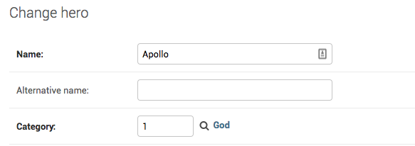
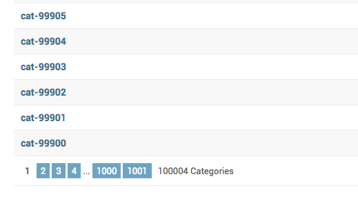

How to manage a model with a FK with a large number of objects?
++++++++++++++++++++++++++++++++++++++++++++++++++++++++++++++++++++++++++++++++++++

You can create a large number of categories like this::

    categories = [Category(**{"name": "cat-{}".format(i)}) for i in range(100000)]
    Category.objects.bulk_create(categories)

Now as :code:`Category` has more than 100000 objects, when you go to the :code:`Hero` admin, it will have category dropdown with 100000 selections.
This will make the page both slow and the dropdown hard to use.

You can change how admin hand;es it by setting the :code:`raw_id_fields`::

    @admin.register(Hero)
    class HeroAdmin(admin.ModelAdmin, ExportCsvMixin):
        ...
        raw_id_fields = ["category"]

This change the Hero admin to look like:

Add the popup looks like this

