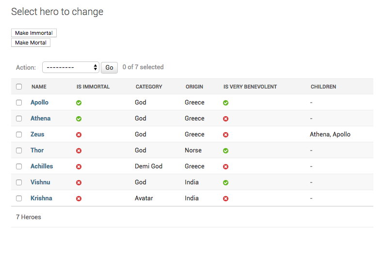

How to show many to many or reverse FK fields on listview page?
================================================================================

For heroes you can track their father using this field::

    father = models.ForeignKey(
        "self", related_name="children", null=True, blank=True, on_delete=models.SET_NULL
    )

You have been asked to show the childeren of each Hero, on the listview page. Hero objects have the :code:`children` reverse FK attribute,
but you can't add that to the :code`:`list_display`. You need to add an attribute to ModelAdmin and use that in :code:`list_display`. You can do it like this::

        @admin.register(Hero)
        class HeroAdmin(admin.ModelAdmin, ExportCsvMixin):
            ...

            def children_display(self, obj):
                return ", ".join([
                    child.name for child in obj.children.all()
                ])
            children_display.short_description = "Children"

You will see a column for children like this:

You can use the same method for M2M relations as well.
