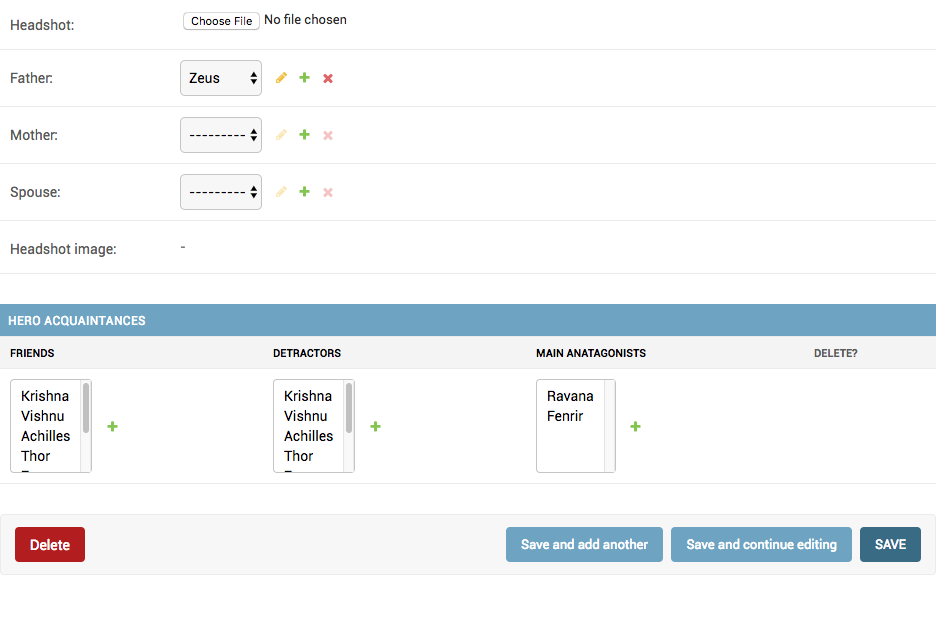

How to add One to One relation as admin inline?
================================================

OneToOneFields can be set as inlines in the same way as a FK. However, only one side of the OneToOneField can be set as the inline model.

You have a :code:`HeroAcquaintance` model which has a One to one relation to hero like this.::

    class HeroAcquaintance(models.Model):
        "Non family contacts of a Hero"
        hero = models.OneToOneField(Hero, on_delete=models.CASCADE)
        ....

You can add this as inline to Hero like this::

    class HeroAcquaintanceInline(admin.TabularInline):
        model = HeroAcquaintance

    @admin.register(Hero)
    class HeroAdmin(admin.ModelAdmin, ExportCsvMixin):
        ...
        inlines = [HeroAcquaintanceInline]

