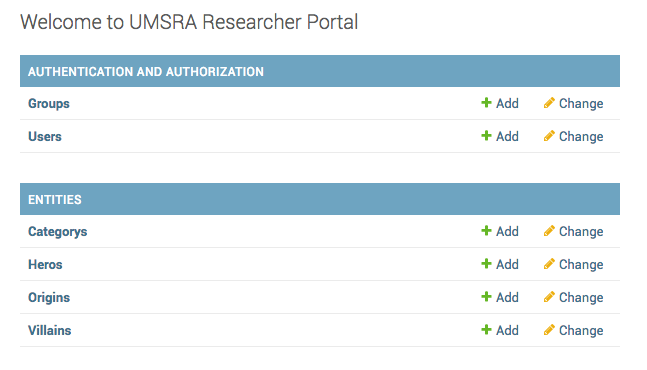
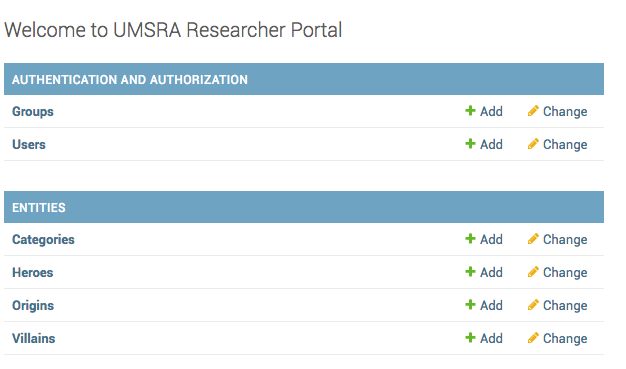

How to set the plural text for a model?
===========================================================

By default admin will show the name of your model appended with an "s", aka the plural form of your model. It looks like this

You have been asked to set the correct plural spellings: `Categories` and  `Heroes`

You can do this by setting the :code:`verbose_name_plural` in your models. Change that in your models.py.::

    class Category(models.Model):
        ...

        class Meta:
            verbose_name_plural = "Categories"

    class Hero(Entity):
        ...

        class Meta:
            verbose_name_plural = "Heroes"

With the changes your Admin will look like this.

