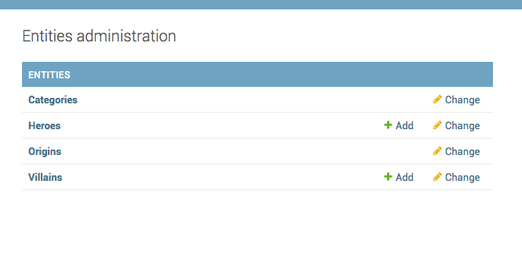

How to remove the 'Add'/'Delete' button for a model?
====================================================

The UMSRA management has added all the Category and Origin objects and wants to disable any further addition and deletion.
They have asked you to disable 'Add' and 'Delete' buttons. You can do this by overriding the
:code:`has_add_permission` and :code:`has_delete_permission` in the Django admin.::

    def has_add_permission(self, request):
        return False

    def has_delete_permission(self, request, obj=None):
        return False

With these changes, the admin looks like this

Note the removed `Add` buttons. The add and delete buttons also get removed from the detail pages. You can also read :doc:`remove_delete_selected`.

