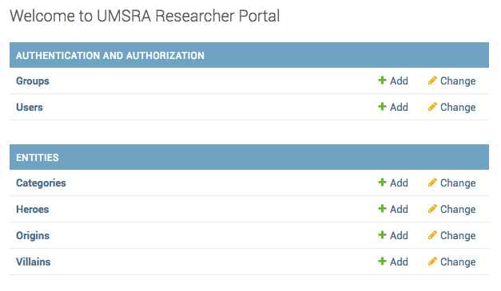
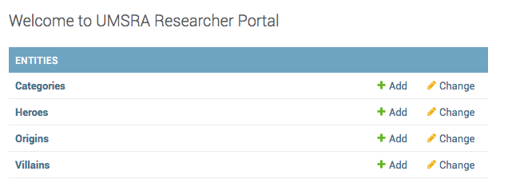

How to remove default apps from Django admin?
===========================================================

Django will include :code:`django.contrib.auth` in :code:`INSTALLED_APPS`,
which means `User` and `Groups` models are included in admin automatically.

If you want to remove it, you will have to unregister them. ::

    from django.contrib.auth.models import User, Group

    admin.site.unregister(User)
    admin.site.unregister(Group)

After making these changes, your admin should look like this.

