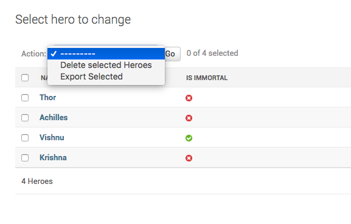

How to remove the delete selected action in Django admin?
++++++++++++++++++++++++++++++++++++++++++++++++++++++++++

By default Django adds a `Delete Selected` action to the listview page. You have been asked to remove
the action from the :code:`Hero` admin.

The method :code:`ModelAdmin.get_actions` returns the actions shown. By overriding this method, to remove :code:`delete_selected`
We can remove it form the dropdown. Your code looks like this with the changes.::

    def get_actions(self, request):
        actions = super().get_actions(request)
        if 'delete_selected' in actions:
            del actions['delete_selected']
        return actions

And your admin looks like this

