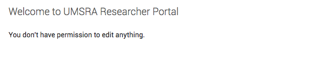
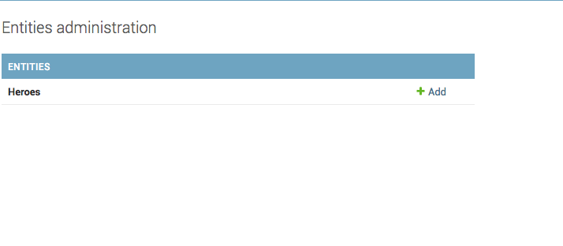

How to restrict access to parts of Django admin?
=================================================

You can enable and restrict access to specific parts of Django admin using the permission system.
When a model is added, by default, Django creates three permissions. :code:`add, change and delete`

Admin uses these permissions to decide access for users. For a user with :code:`is_superuser=False`, and no permissions, the admin looks like this

If you add a permission :code:`user.user_permissions.add(Permission.objects.get(codename="add_hero"))`, the admin starts looking like this

You can add more complex logic to restrict access by changing these methods::

    def has_add_permission(self, request):
        ...

    def has_change_permission(self, request, obj=None):
        ...

    def has_delete_permission(self, request, obj=None):
        ...

    def has_module_permission(self, request):
        ...
