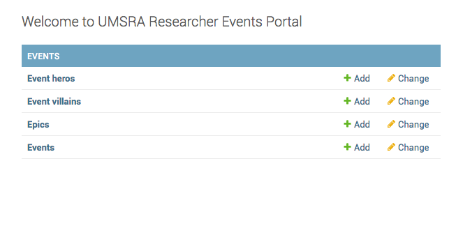

How to set ordering of Apps and models in Django admin dashboard.
=================================================================

Django, by default, orders the models in admin alphabetically. So the order of models in :code:`Event` admin is Epic, EventHero, EventVillain, Event

Instead you want the order to be

* EventHero, EventVillain, Epic  then event.

The template used to render the admin index page is :code:`admin/index.html` and the view function is
:code:`ModelAdmin.index`. ::

    def index(self, request, extra_context=None):
        """
        Display the main admin index page, which lists all of the installed
        apps that have been registered in this site.
        """
        app_list = self.get_app_list(request)
        context = {
            **self.each_context(request),
            'title': self.index_title,
            'app_list': app_list,
            **(extra_context or {}),
        }

        request.current_app = self.name

        return TemplateResponse(request, self.index_template or
            'admin/index.html', context)

The method :code:`get_app_list`, set the order of the models.::

    def get_app_list(self, request):
        """
        Return a sorted list of all the installed apps that have been
        registered in this site.
        """
        app_dict = self._build_app_dict(request)

        # Sort the apps alphabetically.
        app_list = sorted(app_dict.values(), key=lambda x: x['name'].lower())

        # Sort the models alphabetically within each app.
        for app in app_list:
            app['models'].sort(key=lambda x: x['name'])

        return app_list

So to set the order we override :code:`get_app_list` as::

    class EventAdminSite(AdminSite):
        def get_app_list(self, request):
            """
            Return a sorted list of all the installed apps that have been
            registered in this site.
            """
            ordering = {
                "Event heros": 1,
                "Event villains": 2,
                "Epics": 3,
                "Events": 4
            }
            app_dict = self._build_app_dict(request)
            # a.sort(key=lambda x: b.index(x[0]))
            # Sort the apps alphabetically.
            app_list = sorted(app_dict.values(), key=lambda x: x['name'].lower())

            # Sort the models alphabetically within each app.
            for app in app_list:
                app['models'].sort(key=lambda x: ordering[x['name']])

            return app_list

The code :code:`app['models'].sort(key=lambda x: ordering[x['name']])` sets the fixed ordering. Your app now looks like this.

