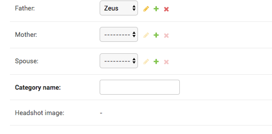

How to create a single Django admin from two different models?
=================================================================

:code:`Hero` has a FK to :code:`Category`, so you can select a category from Hero admin.
If you want to also be able to create :code:`Category` objects from Hero admin, you can change the form for Hero admin, and customise the
:code:`save_model` behaviour.::

    class HeroForm(forms.ModelForm):
        category_name = forms.CharField()

        class Meta:
            model = Hero
            exclude = ["category"]

    @admin.register(Hero)
    class HeroAdmin(admin.ModelAdmin, ExportCsvMixin):
        form = HeroForm
        ....

        def save_model(self, request, obj, form, change):
            category_name = form.cleaned_data["category_name"]
            category, _ = Category.objects.get_or_create(name=category_name)
            obj.category = category
            super().save_model(request, obj, form, change)

With this change, your admin looks like below and has allows creating or updating category from the Hero admin.

