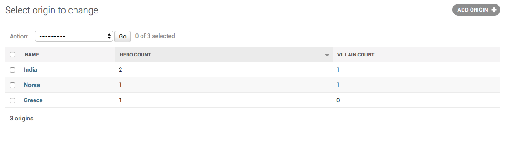

How to enable sorting on calculated fields?
===========================================================

Django adds sorting capabilities on fields which are attributes on the models.
When you add a calculated field Django doesn't know how to do a :code:`order_by`, so it doesn't a sorting capability on that field.

If you want to add sorting on a caluclated field, you have to tell Django, what to pass to :code:`order_by`. You can do this by setting
:code:`admin_order_field` attribute on the calculated field method.

You start from the admin you wrote in the pervious chapter (:doc:`optimize_queries`).::

    hero_count.admin_order_field = '_hero_count'
    villain_count.admin_order_field = '_villain_count'

With these changes your admin becomes::

    @admin.register(Origin)
    class OriginAdmin(admin.ModelAdmin):
        list_display = ("name", "hero_count", "villain_count")

        def get_queryset(self, request):
            queryset = super().get_queryset(request)
            queryset = queryset.annotate(
                _hero_count=Count("hero", distinct=True),
                _villain_count=Count("villain", distinct=True),
            )
            return queryset

        def hero_count(self, obj):
            return obj._hero_count

        def villain_count(self, obj):
            return obj._villain_count

        hero_count.admin_order_field = '_hero_count'
        villain_count.admin_order_field = '_villain_count'

Here is the admin sorted on :code:`hero_count`

