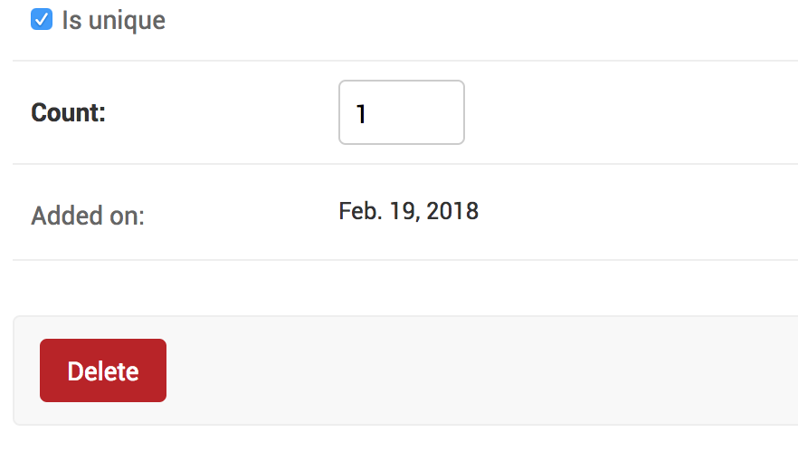

How to show an uneditable field in admin?
++++++++++++++++++++++++++++++++++++++++++++++++++++++++++++++++++++++++++++++++++++

If you have a field with :code:`editable=False` in your model, that field, by default, is hiddent in the change page. This also happens with any field marked as :code:`auto_now` or :code:`auto_now_add`, because that sets the :code:`editable=False` on these fields.

If you want these fields to show up on the change page, you can add them to :code:`readonly_fields`.::

    @admin.register(Villain)
    class VillainAdmin(admin.ModelAdmin, ExportCsvMixin):
        ...
        readonly_fields = ["added_on"]

With this change the Villian admin looks like this:

